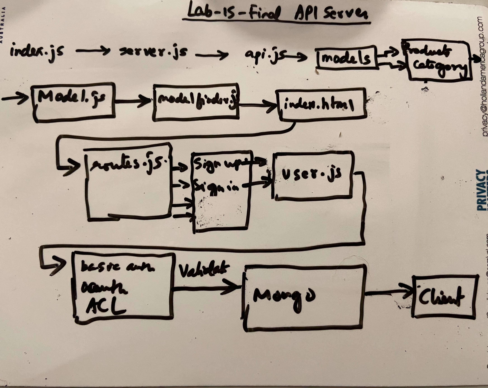

# LAB - 15

## Module 3 Final Project API Server

### Author: Shubham Majumdar

### Links and Resources
* [submission PR](https://github.com/401-advanced-javascript-Shubham/Lab-Authentication/pull/1)
* [Github Actions](https://github.com/401-advanced-javascript-Shubham/Lab-Authentication/actions)

#### Documentation
* [api docs](http://xyz.com/api-docs) (API servers)
* JSDoc Comment Required for all modules and functions in all .js files

### Setup
#### `.env` requirements (where applicable)
* `PORT` - 27017
* `MONGODB_URI` - mongodb://localhost:27017/lab09

#### How to initialize/run your server app (where applicable)
* Troubleshoot Error: EACCES: permission denied ---- sudo npm install -g --unsafe-perm=true --allow-root 
* `npm start`
* npm init
* npm i bcrypt base-64 express cors jsonwebtoken
* npm i dotenv superagent
* npm i @code-fellows/supergoose jest
* npm i express cors morgan dotenv
* npm install mongoose
* npm i -D jest @code-fellows/supergoose

  
#### Tests
* How do you run tests?
npm test

#### UML

